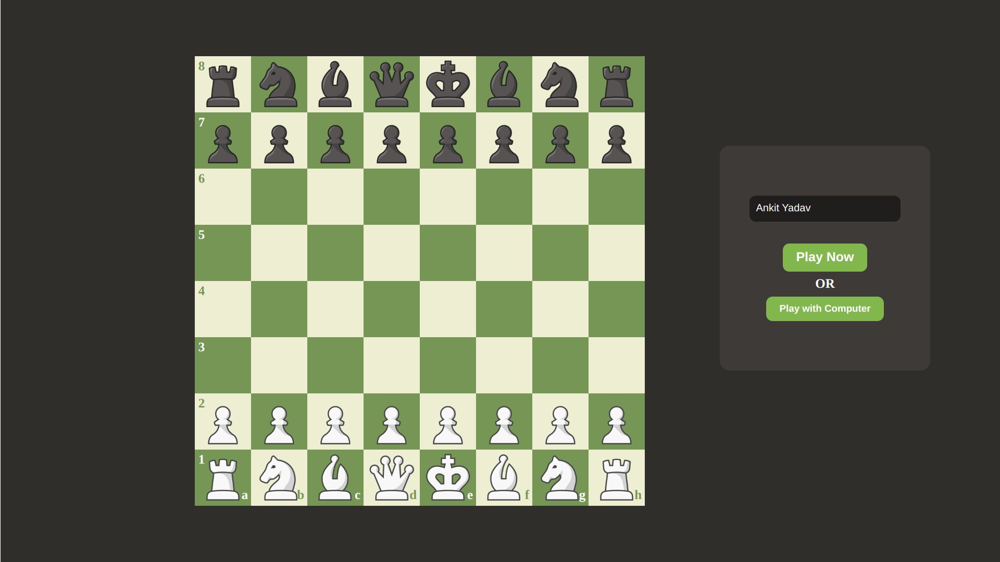
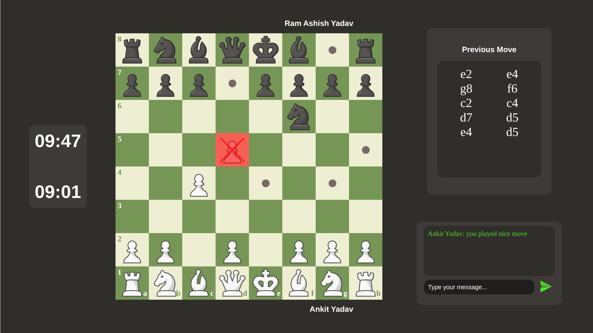
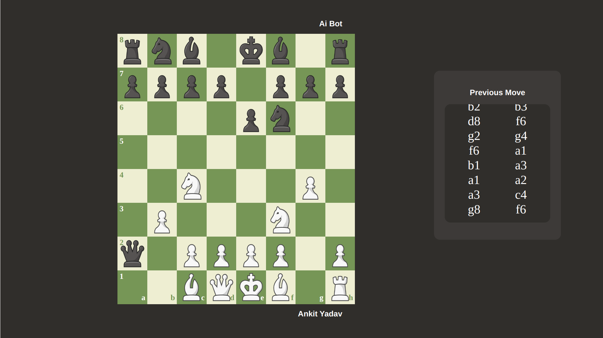

# IntelliChess

A high-performance, multiplayer chess game with a WebSocket-based server and an advanced AI opponent. IntelliChess supports real-time gameplay between human players or against an AI powered by minimax with alpha-beta pruning. The game uses bitboards for efficient board representation and implements all standard chess rules.





## Features

- **Real-time Multiplayer**: Connect and play chess with opponents anywhere via WebSocket connections
- **Advanced AI Opponent**: Challenge a computer player using minimax algorithm with alpha-beta pruning
- **Complete Chess Rules**: Full support for all standard chess moves including castling, en passant, promotion
- **Check & Checkmate Detection**: Automatic detection of check, checkmate, and stalemate conditions
- **Performance-Optimized**: Bitboard-based representation for fast move generation and board evaluation
- **Piece-Square Tables**: Sophisticated board evaluation for the AI opponent
- **Secure Communication**: WebSocket protocol with JSON message format
- **Thread-Safe Design**: Robust game management with mutexes and Boost.Asio strands
- **Error Handling**: Comprehensive handling of invalid moves and network issues

## Technologies Used

- **C++17**: Modern C++ features for efficient and safe code
- **Boost.Asio**: High-performance networking framework
- **OpenSSL**: Secure WebSocket handshaking
- **nlohmann/json**: Fast and intuitive JSON parsing and serialization
- **POSIX Threads**: Multithreading support for concurrent game sessions
- **Bitboards**: Efficient chess board representation and manipulation
- **Standard Libraries**: Extensive use of STL containers and algorithms
- **Custom Headers**: Modular design with `common_header.h` and `gameManager.hpp`

## Installation

### Prerequisites

- Linux system (tested on Ubuntu 20.04+)
- g++ compiler with C++17 support
- Boost libraries
- OpenSSL development libraries

### Step-by-Step Setup

1. Install required dependencies:
   ```bash
   sudo apt-get update
   sudo apt-get install build-essential libboost-all-dev libssl-dev
   ```

2. Clone the repository:
   ```bash
   git clone https://github.com/kumar-ankit-100/IntelliChess.git
   cd IntelliChess
   ```

3. Compile the project:
   ```bash
   g++ -o chess final.cpp ai_algorithm.cpp bishop.cpp checkCondition.cpp chess.cpp common_header.cpp king.cpp knight.cpp pawn.cpp queen.cpp rook.cpp -I. -I/usr/include/boost -lboost_system -lboost_thread -pthread -lssl -lcrypto -std=c++17 -DBOOST_ASIO_NO_DEPRECATED
   ```

4. Run the server:
   ```bash
   ./chess
   ```

## Usage

### Starting the Server

The IntelliChess server listens on port 8080 by default:

```bash
./chess
```

### Connecting Clients

Connect any WebSocket-compatible chess frontend to the server at:
```
ws://localhost:8080
```

### Game Modes

#### Human vs Human
Players are automatically matched when two clients connect to the server. The game can be played through our intuitive web-based frontend built with HTML, CSS, and JavaScript, providing a smooth chess experience directly in the browser.
#### Human vs AI
Send a request to play against the AI:
```json
{"purpose": "playWithAI"}
```

### Making Moves

Send chess moves using JSON format:
```json
{
  "purpose": "generateMove",
  "position": "e2e4",
  "pieceName": "pawn"
}
```

The server validates moves and updates the game state accordingly, responding with the new board position and any game status changes.

## Project Structure

```
Chess_game_in_cpp/
├── final.cpp               # WebSocket server implementation
├── ai_algorithm.cpp        # AI move generation with minimax
├── bishop.cpp              # Bishop movement logic
├── king.cpp                # King movement logic
├── knight.cpp              # Knight movement logic
├── pawn.cpp                # Pawn movement logic
├── queen.cpp               # Queen movement logic
├── rook.cpp                # Rook movement logic
├── checkCondition.cpp      # Check/checkmate detection
├── chess.cpp               # Core board logic and game rules
├── common_header.cpp       # Utility functions implementation
├── common_header.h         # Common declarations and utilities
├── gameManager.hpp         # Game session management
├── json.hpp                # nlohmann/json library
└── readme.md               # Project documentation
```

## Technical Details

### Architecture

IntelliChess is built around a multi-threaded WebSocket server that handles client connections and game state:

- **Networking**: Boost.Asio powers the asynchronous WebSocket server
- **Concurrency**: Thread pool with 8 threads handles multiple simultaneous games
- **Game Management**: `GameManager` class tracks active games and player relationships
- **Board Representation**: Bitboards enable efficient move generation and evaluation
- **AI Engine**: Minimax algorithm with alpha-beta pruning uses piece-square tables for position evaluation
- **Thread Safety**: Mutexes and Boost.Asio strands ensure data integrity during concurrent operations
- **Communication**: JSON-based message protocol for client-server interaction

### AI Implementation

The AI opponent evaluates positions using:
- Material balance
- Piece-square tables for positional evaluation
- Mobility assessment
- King safety factors
- Search depth of 4-6 moves (configurable)
- minimax algorithm with alpha-beta pruning

## Contributing

We welcome contributions to IntelliChess! Please follow these guidelines:

1. Fork the repository
2. Create a feature branch (`git checkout -b feature/amazing-feature`)
3. Commit your changes (`git commit -m 'Add amazing feature'`)
4. Push to the branch (`git push origin feature/amazing-feature`)
5. Open a Pull Request

### Development Guidelines

- Follow C++17 coding standards
- Include tests for new features
- Document public APIs and complex algorithms
- Ensure thread safety for shared resources


## Acknowledgments

- The chess community for algorithm insights
- Boost.Asio for the networking foundation
- nlohmann/json for the excellent C++ JSON library